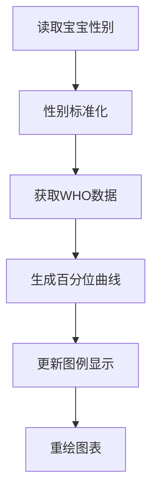

# WHO成长曲线性别自动切换功能

## 🎯 功能概述

WHO成长曲线系统现在能够根据宝宝的性别信息，自动切换到对应的性别标准，无需手动操作。系统支持男宝宝和女宝宝的不同成长标准，确保提供最准确的发育评估。

## 🔧 核心特性

### 1. 自动性别识别
- **智能检测**：系统自动读取宝宝档案中的性别信息
- **实时切换**：性别信息变更时，WHO曲线立即更新
- **兼容性强**：支持多种性别值格式（male/female, boy/girl）

### 2. 性别标准化处理
```javascript
normalizeGender(rawGender) {
  if (rawGender === 'male' || rawGender === 'boy') {
    return 'boy'
  } else if (rawGender === 'female' || rawGender === 'girl') {
    return 'girl'
  } else {
    return 'default'
  }
}
```

### 3. 性别文本显示
```javascript
getGenderText(gender) {
  if (gender === 'male' || gender === 'boy') {
    return '男宝'
  } else if (gender === 'female' || gender === 'girl') {
    return '女宝'
  } else {
    return '未设置'
  }
}
```

## 📊 WHO数据差异

### 男宝宝 vs 女宝宝标准对比（6个月）

| 指标 | 男宝P50 | 女宝P50 | 差异 |
|------|---------|---------|------|
| 体重 | 7.9kg | 7.3kg | +0.6kg |
| 身高 | 67.6cm | 65.7cm | +1.9cm |
| 头围 | 43.3cm | 42.2cm | +1.1cm |

### 性别差异的重要性
- **生理差异**：男女宝宝的发育速度和模式不同
- **评估准确性**：使用对应性别标准才能准确评估发育状况
- **医学依据**：WHO基于大样本数据制定的性别区分标准

## 🎨 图表显示优化

### 图例自动更新
- **性别标识**：图例中显示"P50(男宝)"或"P50(女宝)"
- **动态切换**：性别变更时图例自动更新
- **视觉区分**：不同性别使用不同的主题色彩

### 修复前后对比
```javascript
// 修复前（错误）
const genderText = this.data.babyInfo?.gender === 'girl' ? '女宝' : '男宝'

// 修复后（正确）
const genderText = this.getGenderText(this.data.babyInfo?.gender)
```

## 🔄 自动切换机制

### 触发时机
1. **页面加载时**：读取宝宝信息并应用对应标准
2. **性别更新时**：宝宝档案性别变更后自动切换
3. **图表重绘时**：每次绘制图表都使用最新的性别标准

### 切换流程


## 🧪 测试功能

### 性别切换测试
新增了专门的测试功能来验证性别自动切换：

```javascript
testWHOGenderSwitch() {
  // 测试不同性别值的处理
  const testGenders = [
    { gender: 'male', expected: '男宝' },
    { gender: 'female', expected: '女宝' },
    { gender: 'boy', expected: '男宝' },
    { gender: 'girl', expected: '女宝' },
    { gender: null, expected: '未设置' }
  ]
  
  // 验证每种情况的处理结果
  testGenders.forEach(test => {
    const genderText = this.getGenderText(test.gender)
    const normalizedGender = this.normalizeGender(test.gender)
    const weightP50 = this.getWHOPercentileValue('weight', 6, 'P50', normalizedGender)
    
    console.log(`性别: ${test.gender} -> 显示: ${genderText} -> WHO数据: ${weightP50}kg`)
  })
}
```

### 测试按钮
在调试工具中添加了"🚻 测试性别切换"按钮，可以：
- 验证不同性别值的处理
- 检查WHO数据获取的正确性
- 确认图例显示的准确性

## 📈 数据准确性保证

### WHO标准数据
- **男宝数据**：基于WHO男童成长标准（0-60个月）
- **女宝数据**：基于WHO女童成长标准（0-60个月）
- **百分位完整**：P3, P15, P50, P85, P97 五个百分位

### 数据验证
```javascript
// 验证6个月男宝体重P50标准值
const maleWeightP50 = this.getWHOPercentileValue('weight', 6, 'P50', 'boy')
console.log('6个月男宝体重P50:', maleWeightP50) // 应该是 7.9kg

// 验证6个月女宝体重P50标准值  
const femaleWeightP50 = this.getWHOPercentileValue('weight', 6, 'P50', 'girl')
console.log('6个月女宝体重P50:', femaleWeightP50) // 应该是 7.3kg
```

## 🎯 用户体验

### 无感知切换
- **自动识别**：用户设置宝宝性别后，系统自动应用对应标准
- **即时更新**：性别变更后图表立即更新，无需刷新页面
- **准确评估**：始终使用正确的性别标准进行发育评估

### 视觉反馈
- **图例标识**：清楚显示当前使用的性别标准
- **主题适配**：图表主题色彩与性别设置保持一致
- **状态提示**：性别未设置时显示"未设置"状态

## 🔧 技术实现

### 关键修复点
1. **图例绘制**：修复了性别判断逻辑错误
2. **数据获取**：确保所有WHO数据获取都使用标准化性别
3. **参数传递**：统一使用normalizedGender参数

### 代码优化
- **统一接口**：所有性别相关操作都通过标准化函数处理
- **错误处理**：对无效性别值提供默认处理
- **性能优化**：避免重复的性别转换操作

## 📋 使用指南

### 设置宝宝性别
1. 进入"我的宝宝"页面
2. 点击性别设置项
3. 选择"男"或"女"
4. 保存后系统自动切换WHO标准

### 验证切换效果
1. 查看成长曲线图例中的性别标识
2. 对比不同性别的百分位数值
3. 使用测试功能验证切换正确性

## 🎉 功能优势

1. **医学准确性**：使用正确的性别标准进行评估
2. **用户友好**：自动化处理，无需手动操作
3. **数据可靠**：基于WHO官方标准数据
4. **兼容性强**：支持多种性别值格式
5. **实时更新**：性别变更后立即生效

## 🔮 未来扩展

- **多语言支持**：支持不同语言的性别显示
- **个性化标准**：支持基于地区的成长标准
- **智能提醒**：性别设置异常时的智能提醒
- **数据分析**：基于性别的成长趋势分析

---

通过这个功能，家长们可以获得更准确、更个性化的宝宝成长评估，让育儿过程更加科学和放心。 